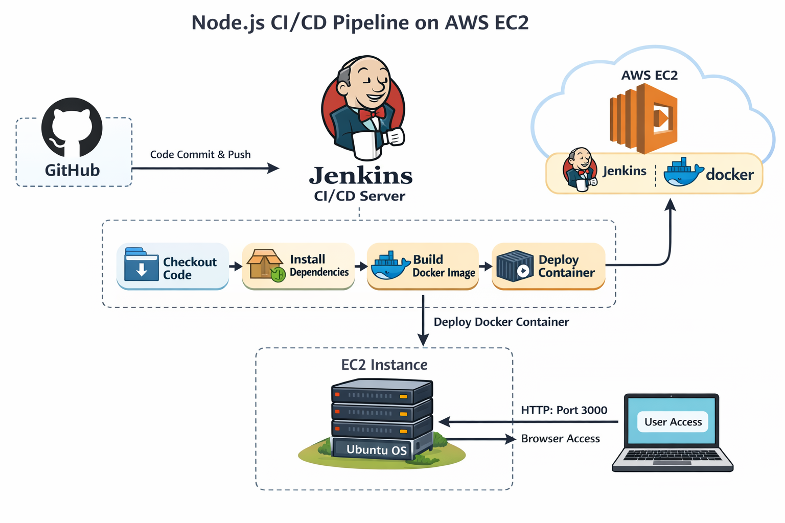

#  Node.js Application Deployment using Jenkins & Docker on AWS EC2 (Ubuntu)

This project demonstrates a complete CI/CD pipeline where:

Developer → GitHub → Jenkins → Docker → Deployment on AWS EC2 (Ubuntu)

The application is deployed on an Ubuntu EC2 instance with proper Security Group configuration.

---

# 🏗️ Project Architecture

Local Developer  
        ↓  
GitHub Repository  
        ↓  
Jenkins Pipeline (Running on EC2 Ubuntu)  
        ↓  
Docker Build  
        ↓  
Container Deployment  
---



---

##  **Step 1: Launch EC2 Instance (Ubuntu)**

    1. Login to AWS Console

    2. Go to EC2 → Click **Launch Instance**

    3. Configure:

###  **Name:-** Jenkins

### **AMI:-** Ubuntu Server 22.04 LTS

### **Instance Type:-** t2.micro (Free Tier)

---

## **Step 2: Configure Security Group (Very Important)**

### Create a new Security Group with following inbound rules:-

| Type        | Port | Source        |
|------------|------|--------------|
| SSH        | 22   | My IP        |
| HTTP       | 80   | Anywhere     |
| Custom TCP | 8080 | Anywhere     |
| Custom TCP | 3000 | Anywhere     |

### **Explanation:-**
- 22 → SSH access
- 8080 → Jenkins
- 3000 → Node.js Application
- 80 → Optional web access

### **Launch the instance.**


---

## **Step 3: Connect to EC2 (Ubuntu)**

```bash
ssh -i your-key.pem ubuntu@<your-ec2-public-ip>
```

---

## **Step 4: Install Required Software on Ubuntu EC2**

## 1) Update System

```bash
sudo apt update && sudo apt upgrade -y
```

---

## 2) Install Java (Required for Jenkins)

```bash
sudo apt install openjdk-17-jdk -y
java -version
```

---

## 3️) Install Jenkins

```bash
curl -fsSL https://pkg.jenkins.io/debian-stable/jenkins.io.key | sudo tee \
/usr/share/keyrings/jenkins-keyring.asc > /dev/null

echo deb [signed-by=/usr/share/keyrings/jenkins-keyring.asc] \
https://pkg.jenkins.io/debian-stable binary/ | sudo tee \
/etc/apt/sources.list.d/jenkins.list > /dev/null

sudo apt update
sudo apt install jenkins -y
```

Start Jenkins:

```bash
sudo systemctl start jenkins
sudo systemctl enable jenkins
```

Get initial password:

```bash
sudo cat /var/lib/jenkins/secrets/initialAdminPassword
```

Access Jenkins:
```
http://<EC2-Public-IP>:8080
```

---

## 4️) Install Docker

```bash
sudo apt install docker.io -y
sudo systemctl start docker
sudo systemctl enable docker
```

Add Jenkins to Docker group:

```bash
sudo usermod -aG docker jenkins
sudo systemctl restart jenkins
```

Verify:

```bash
docker --version
```

---

## 5️) Install Git

```bash
sudo apt install git -y
git --version
```

---

# **Step 5: Install Jenkins Plugins**


#### **Manage Jenkins → Manage Plugins → Available Plugins**

### **Install:**

- Git Plugin
- Pipeline Plugin
- Docker Pipeline Plugin
- Docker Plugin
- NodeJS Plugin
- GitHub Integration Plugin

### ***Restart Jenkins after installation.***

---

## **Step 6: Configure Tools in Jenkins**

Manage Jenkins → Global Tool Configuration

Add:

NodeJS → Install Automatically  
Git → Install Automatically  

Save.

---

## 🐳 Dockerfile

```dockerfile
FROM node:18
WORKDIR /nodeapp
COPY . .
RUN npm install
EXPOSE 3000
CMD ["node", "app.js"]
```

---

## 📜 Jenkinsfile
```groovy
pipeline {
    agent any

    stages {
        stage('pull') {
            steps {
                git branch: 'main', url: 'https://github.com/techrohitx/Automated-CI-CD-Pipeline-using-Jenkins-and-Docker.git'
            }
        }
        stage('Build Docker Image') {
            steps {
                sh 'docker build -t devops-app .'
            }
        }
        stage('Deploy Container') {
            steps {
                sh 'docker rm -f devops-container || true'
                sh 'docker run -d -p 3000:3000 --name devops-container devops-app'
            }
        }
    }
}
```
## **Step 7: Create Jenkins Pipeline Job**

1. Click New Item
2. Enter name → NodeJS-Docker-CICD
3. Select Pipeline
4. Choose:
   - Pipeline script from SCM
   - Git
   - Repository URL:
     https://github.com/techrohitx/Node.js-Application-Deployment-using-Jenkins-Docker.git
   - Branch → */main
   - Script Path → jenkinsfile

### **Save.**


---

## **Step 8: Run Pipeline**

### **Click Build Now.then successful, access application:**
---


## **Step 9: Verify Docker Container is Running**

### **After pipeline success, Jenkins automatically builds and runs the Docker container. using jenkinsfile**


## **Step 10: Access Application Using Public IP** 

### **Open your browser and enter:**

```
http://<EC2-Public-IP>:3000
```
---


## 📌 Project Summary

This project demonstrates an automated CI/CD pipeline for deploying a Node.js application on AWS EC2 (Ubuntu) using Jenkins and Docker.  
Whenever code is pushed to GitHub, Jenkins automatically builds a Docker image and deploys the application inside a container.